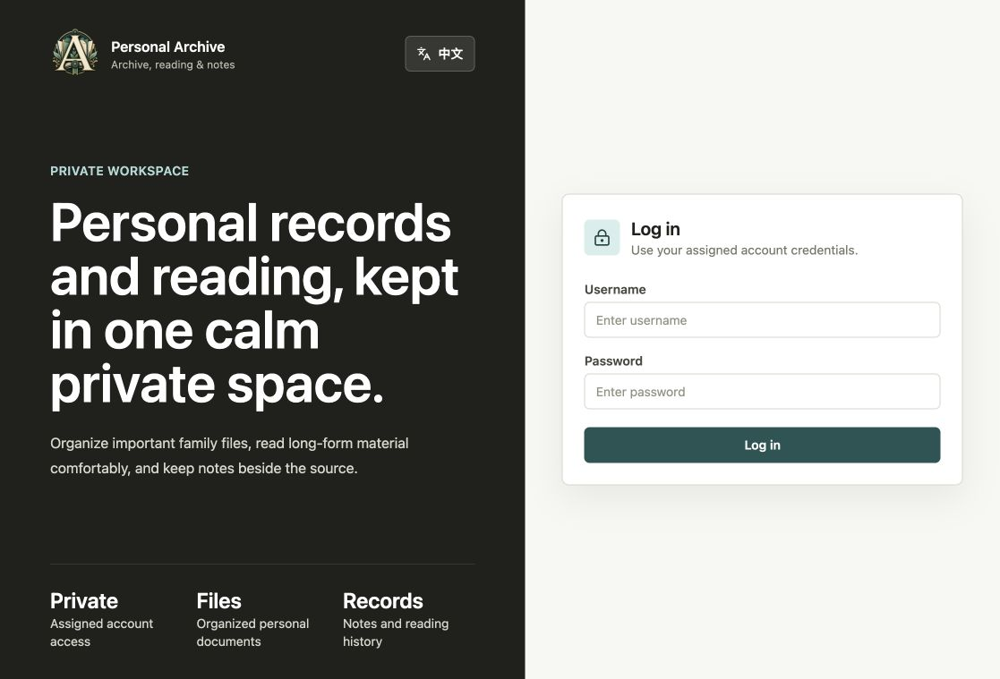
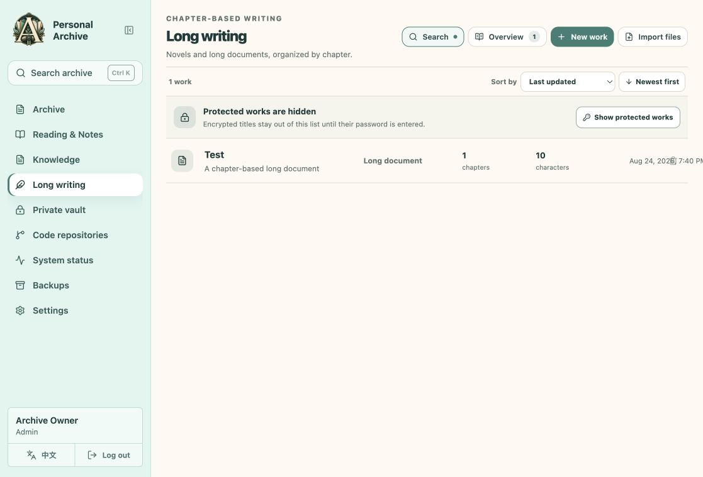
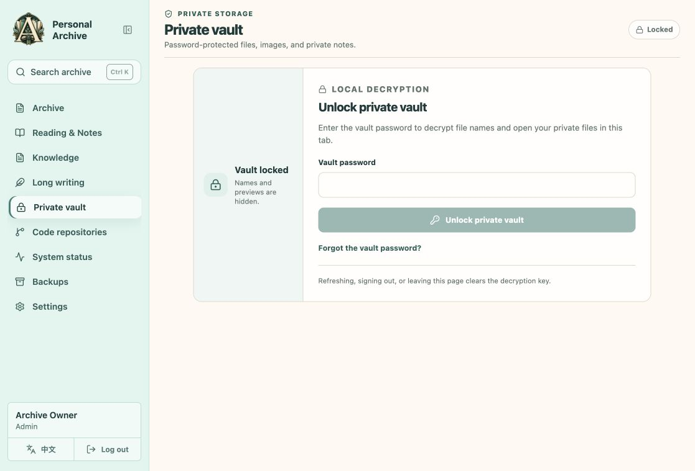

# Personal Archive

A self-hosted workspace for documents, reading notes, knowledge, long writing, and a personal encrypted vault.

**Alpha:** this is an early self-hosted release. Use replaceable test data while evaluating it, and back up your database, object storage, and keys before keeping important material here.

## What it does

- Organize files in folders, keep versions, preview/download documents, and recover items from the trash.
- Browse images with fit and fullscreen controls, and play audio files from an Archive folder in a persistent queue.
- Read documents and keep notes or structured knowledge alongside them.
- Write in chapters with history, personal reading bookmarks and export; optionally encrypt a work in the browser.
- Keep a vault scoped to your account, with a separate password.

Ordinary Archive documents, notes and unencrypted writing are shared within an instance. Vault ownership is separate. Server-assisted recovery has access boundaries and depends on preserved recovery keys; this is not a promise that a server operator can never decrypt data.

## Screenshots

These screenshots were taken from test-only or locked views. They do not show private documents or vault contents.







## Install on one Linux host

With Docker Engine and Docker Compose v2.24+ installed, clone this repository and run:

```sh
git clone https://github.com/Alenwan/personal-archive.git
sh personal-archive/release/selfhost/install.sh
```

The interactive installer runs the app, PostgreSQL and private Garage object storage on one host. It creates the buckets, runs migrations and asks you to create the first administrator. There is **no default account or password**. The app binds to the host's loopback interface; access from other devices needs an HTTPS reverse proxy or SSH tunnel. See the [English installation and account guide](release/selfhost/README.md) or [中文安装说明](release/selfhost/README.zh-CN.md). An existing S3-compatible service can still be used through the manual path.

The combined installer passed a fresh Docker/Linux arm64 run with PostgreSQL 16.13 and Garage 2.3.0: administrator login, account creation, readiness and safe repeat installation. The new recovery commands passed a synthetic backup and empty-instance restore on Ubuntu 24.04/amd64, including original file bytes, a note, a chapter and a backup-bucket manifest. External HTTPS, larger real-world archives and the separate production MinIO layout remain untested. See the [validation record](release/selfhost/VALIDATION.md) for exact coverage.

## Development

Use Node 24.19.0 and npm 12.0.2, as recorded in `.nvmrc` and `package.json`.

```sh
npm ci --ignore-scripts
npm run typecheck
npm test
npm run build
npm run build:selfhost
```

For the separate bookmark dump/restore integration test, run `npm run test:bookmarks` with `POSTGRES_BIN_DIR` and `POSTGRES_CLIENT_BIN_DIR` pointing to PostgreSQL 16 server and client tools. It creates and removes a disposable local database cluster.

The frontend defaults to Personal Archive. Other inherited templates require an explicit `VITE_BUSINESS_TEMPLATE` selection. `npm run dev` starts the frontend only; it does not provision the API, PostgreSQL, or S3 storage. Use the Docker guide for the supported installation candidate.

`npm run test:postgres` starts and removes its own synthetic PostgreSQL cluster. It requires PostgreSQL 16 server/client binaries and refuses inherited database targets; set `POSTGRES_BIN_DIR` and `POSTGRES_CLIENT_BIN_DIR` to the directories containing those tools. It never uses an existing application database as a test target.

## Known limits

- Alpha targets a single administrator or a trusted household. The server-side account command can list, create and reset users; invitations, mail delivery, full in-app member management and arbitrary folder ACLs are deferred.
- File references are retained conservatively. Encrypted writing or encrypted chapter history can suspend permanent file cleanup; trash and restore remain available.
- Forgejo repository management is retired from the application. Existing snapshot objects are not deleted; preserve all objects when backing up or importing an old instance.
- Some legacy platform modules remain in the source/schema for compatibility. They are not advertised as Personal Archive features.
- The in-app backup page is not a complete disaster-recovery solution. The bundled one-host installation has encrypted backup, verification and empty-instance recovery commands; keep an off-host copy and rehearse recovery. External S3 and the separate production MinIO layout require their own procedures. See the installation guide before upgrades or important use.

## Licensing and feedback

Copyright 2026 Alenwan. Personal Archive's source code and included project branding/screenshots are licensed under [GNU AGPL v3 only](LICENSE). Third-party components retain their own terms.

Builds include third-party component lists and original license texts in both output directories. See [notice collection and provenance](release/licenses/README.md) for coverage and the version-bound Postgres.js license fallback.

For security issues, follow [the private-reporting guidance](SECURITY.md). Do not publish real documents, credentials, database dumps or exploitable security details in public feedback.

---

## 中文简介

Personal Archive 是面向个人与家庭的自托管资料工具，集中保存档案、阅读笔记、知识条目和长篇文稿，并提供按账号隔离的 Vault。

当前优先发布功能有限、能安装的 Alpha。Archive 支持图片适配/全屏浏览，以及按文件夹顺序批量播放音乐；Long writing 支持个人阅读书签。请从[中文单机安装说明](release/selfhost/README.zh-CN.md)或[英文完整指南](release/selfhost/README.md)开始：需要 Docker Compose，安装脚本会配置私有对象存储和首管理员；没有默认账号。普通档案按实例共享读取，Vault 和加密长文的独立密码及恢复密钥需妥善保管。

邀请邮件、完整界面成员管理、复杂附件继承和更多安装平台以后再补。已有保守的数据保留限制继续生效。单机安装脚本已在隔离 Linux/arm64 VM 完成首装、账号与重复运行验证；新的加密备份与空实例恢复命令已在 Ubuntu 24.04/amd64 上通过合成数据演练。真实大容量资料和外部 HTTPS 仍需进一步验证。源码和项目图标/截图依 [GNU AGPL v3 only](LICENSE) 开放，第三方组件保留各自许可。
